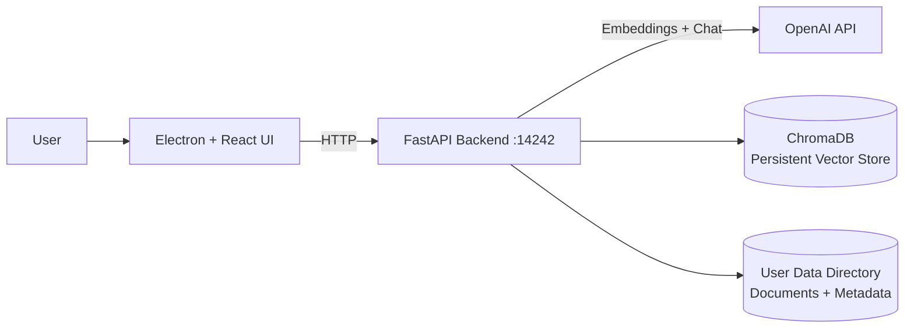
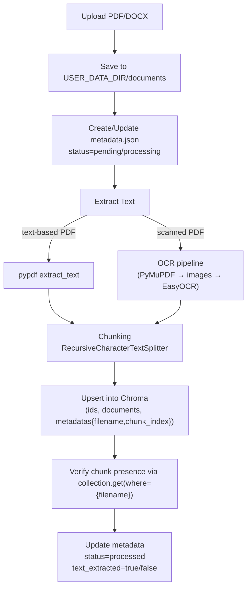
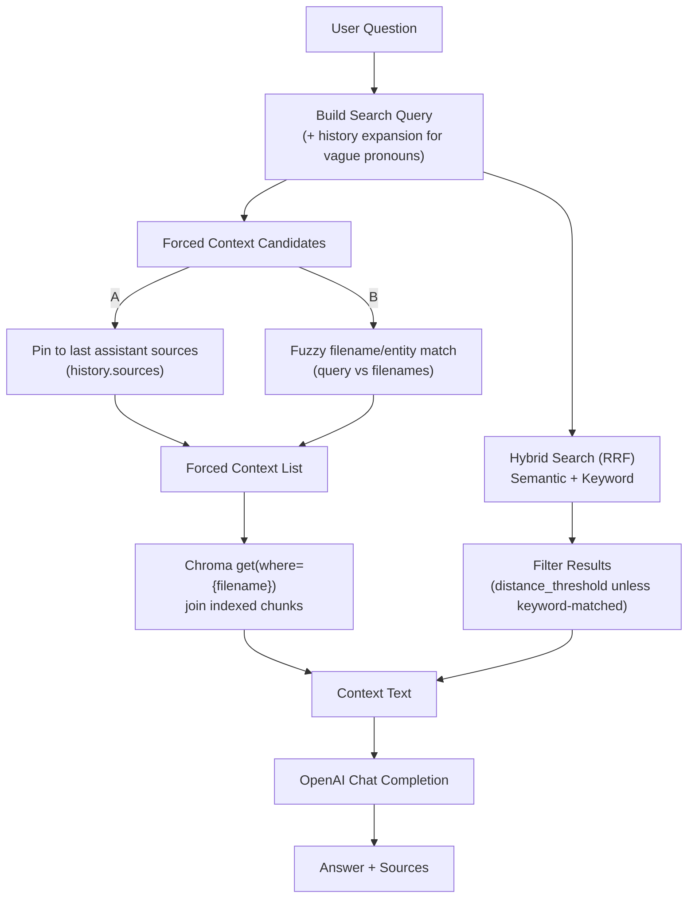
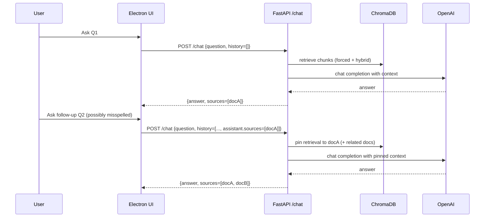

# RAG Architecture (Current Implementation)

This document describes the **current Retrieval-Augmented Generation (RAG)** implementation in DocuSenseLM, including indexing, retrieval, multi-turn behavior, persistence, and diagnostics.

---

## High-Level Components

- **Electron + React UI**: Uploads documents, shows processing status, and provides Chat.
- **Python FastAPI backend** (`python/server.py`): Handles upload/processing, OCR, indexing, retrieval, and LLM calls.
- **Vector DB**: **ChromaDB** (`chromadb.PersistentClient`) stored under the user data directory.
- **LLM + Embeddings**: OpenAI (embeddings: `text-embedding-3-small`, chat model configurable via `LLM_MODEL`).

---

## System Context (C4-style)

---

## Persistence & Data Locations

The backend resolves a **user data directory** and persists everything there:

- **USER_DATA_DIR**: provided by Electron via env `USER_DATA_DIR=app.getPath('userData')`
- **DOCUMENTS_DIR**: `${USER_DATA_DIR}/documents`
- **METADATA_FILE**: `${DOCUMENTS_DIR}/metadata.json`
- **DB_DIR (Chroma)**: `${USER_DATA_DIR}/chroma_db`

Chroma is created with:

- `chroma_client = chromadb.PersistentClient(path=DB_DIR)`
- `collection = chroma_client.get_or_create_collection(name=<rag.collection_name>)`

---

## Configuration (Default + User Override Merge)

The backend loads config using a **deep merge**:

1. Load `config.default.yaml` (defaults)
2. Load `${USER_DATA_DIR}/config.yaml` (user overrides, if present)
3. Deep-merge user values over defaults

RAG-related config keys:

- `rag.collection_name` (default `nda_documents`)
- `rag.distance_threshold` (default `0.75`)
- `rag.max_pinned_files` (default `3`)

---

## Indexing Pipeline (Upload → Extract → Chunk → Embed → Upsert)

### Scanned PDF Handling

- The backend detects scanned PDFs using lightweight heuristics (low text density / DocuSign-only text, etc.)
- If OCR libraries aren’t available, OCR is disabled and such PDFs will not become searchable (`text_extracted=false`)

---

## Retrieval Pipeline (Chat Request)

Chat endpoint: `POST /chat`

Inputs:

- `question: str`
- `history: List[ChatMessage]` where each message has:
  - `role: "user" | "assistant"`
  - `content: str`
  - `sources?: List[str]` *(assistant messages only; sent by the UI)*

Outputs:

- `answer: str`
- `sources: List[str]` (filenames)

### Retrieval Overview

---

## Hybrid Search Details (RRF)

The backend uses **Reciprocal Rank Fusion (RRF)**:

- **Semantic search**: `collection.query(query_texts=[q], include=[documents, metadatas, distances])`
- **Keyword search**: BM25-style scoring over all indexed chunks
- **Fusion**: combine ranks from semantic and keyword results into an RRF score

This prevents misses where the key term is a small part of a long chunk (e.g., “weeding” inside a long maintenance agreement).

---

## Multi-Turn Stability (Pinned Sources)

Instead of relying solely on new query terms (which are often short, misspelled, or ambiguous), the system uses a **best-practice multi-turn approach**:

- The UI includes `sources` from the last assistant message in subsequent requests.
- The backend uses those sources as **pinned context files**, ensuring follow-up questions stay in the same “document set.”
- The backend can also expand to closely related docs by filename token similarity (e.g., “Franny maintenance” → “Franny snow contract”).

---

## Diagnostics & Self-Heal Endpoints

To prevent “silent RAG failure,” the backend exposes:

- `GET /rag/status`
  - Reports: `USER_DATA_DIR`, `DB_DIR`, collection name, chunk counts, Franny chunk count, and any “processed but missing index” docs.
- `GET /rag/debug-search?q=...`
  - Returns retrieval candidates and which chunks would be included **without calling the LLM**.
- `GET /rag/chunks?filename=...`
  - Returns a preview of indexed chunks for a specific document.
- `POST /rag/rebuild-missing`
  - Reindexes docs that are marked searchable in metadata but have no chunks in Chroma.

---

## Known Limits (Current MVP Behavior)

- **Numeric/date fidelity**: Even with correct sources, the LLM may occasionally paraphrase incorrectly; mitigations include quoting snippets and/or structured extraction for currency/dates.
- **OCR variability**: OCR quality depends on PDF scan quality and availability of OCR libraries.
- **Latency**: Hybrid retrieval + LLM calls can be slower on large corpora; pinned sources reduce work on follow-ups.

---

## Regression Suite

See:

- `docs/RAG_REGRESSION_QUESTIONS.md`
- `tests/test_rag_golden_questions.py`
- OCR fixture generator: `tests/fixtures/generate_scanned_test_pdfs.py`

